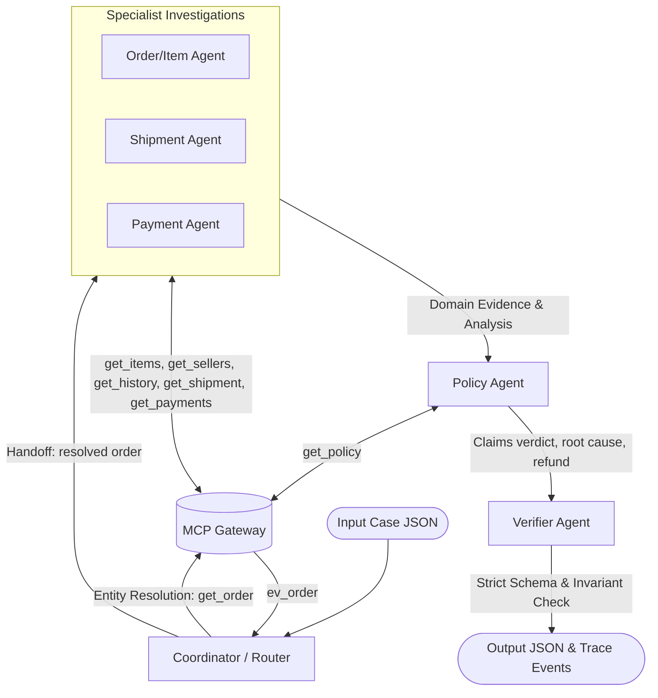

# L3B Architecture Record

Tài liệu thiết kế kiến trúc hệ thống Multi-Agent (A2A) cho giải quyết tranh chấp thương mại điện tử Day09 L3B.

## 1. System overview

Kiến trúc luồng xử lý từ input case, candidate resolution, điều tra MCP, specialist agents, giải quyết mâu thuẫn dữ liệu, chính sách, thẩm định và xuất bản trace.

```text
                          ┌──────────────────────────┐
                          │   Coordinator / Router   │
                          └─────────────┬────────────┘
                                        │ (Handoff)
         ┌──────────────────────────────┼──────────────────────────────┐
         ▼                              ▼                              ▼
┌──────────────────┐           ┌──────────────────┐           ┌──────────────────┐
│ Order/Item Agent │           │  Payment Agent   │           │  Shipment Agent  │
└────────┬─────────┘           └────────┬─────────┘           └────────┬─────────┘
         │                              │                              │
         └──────────────────────────────┼──────────────────────────────┘
                                        │ (MCP Evidence Collector)
                                        ▼
                               ┌──────────────────┐
                               │   Policy Agent   │
                               └────────┬─────────┘
                                        │ (Handoff)
                                        ▼
                               ┌──────────────────┐
                               │  Verifier Agent  │
                               └────────┬─────────┘
                                        │ (Validated Output)
                                        ▼
                                   [END OUTPUT]
```



## 2. Agent ownership

Áp dụng nguyên tắc đặc quyền tối thiểu (Least Privilege). Từng agent chỉ có quyền gọi các tool thuộc phạm vi phụ trách:

| Actor | Input | Trách nhiệm | Tool permission | Output / Handoff |
| --- | --- | --- | --- | --- |
| **Coordinator / Router** | `case_id`, `candidate_order_ids`, `claimed_order_id` | Phân giải thực thể (Entity Resolution), xác minh order hợp lệ và loại trừ candidate giả mạo | `get_order` | `resolved_order_ids`, `rejected_candidates`, handoff sang Specialists |
| **Order / Item Agent** | `order_id`, `investigation_scope`, `customer_unique_id_hint` | Trích xuất danh sách sản phẩm, gian hàng bán (sellers), danh mục sản phẩm và lịch sử khách hàng | `get_order_items`, `get_sellers`, `get_product_context`, `get_customer_history` | `items_data`, `sellers_data`, `customer_context`, data conflicts (nếu có) |
| **Shipment Agent** | `order_id`, `items_data` | Phân tích mốc thời gian giao hàng: người bán bàn giao bưu cục vs shipping limit, bưu cục giao khách vs estimated delivery | `get_shipment_summary` | `shipment_analysis` (`verdict`, `late_seller_ids`, `timeline_complete`) |
| **Payment Agent** | `order_id` | Đối soát dòng tiền: phát hiện trùng thu (duplicate charge), chia nhỏ thanh toán (split payment), đối soát hoàn tiền | `get_order_payments`, `get_payment_timeline`, `get_refund_timeline` | `payment_analysis` (`verdict`, `captured_total_brl`, `refunded_total_brl`, `refundable_total_brl`) |
| **Policy Agent** | Claims của khách hàng, kết quả từ các Specialist, `policy_version` | Đối chiếu quy tắc bồi hoàn của sàn thương mại điện tử, xác định nguyên nhân gốc rễ, bên chịu trách nhiệm và số tiền hoàn | `get_policy` | `assessment`, `claim_assessments`, `root_cause_analysis`, `financial_resolution`, `resolution_actions` |
| **Verifier Agent** | Tổng hợp State từ toàn bộ các Agent | Kiểm tra tính bất biến (invariants), đối soát Schema hợp đồng `l3b-output-v2.schema.json`, đảm bảo không rò rỉ secret | *None* (Không gọi MCP, đóng vai trò thẩm định độc lập) | File `outputs/{case_id}.json` hoàn chỉnh & trace event `verification_completed` |

## 3. Entity resolution và A2A protocol

- **Candidate Ranking & Rejection:**
  1. Ưu tiên kiểm tra `claimed_order_id` từ yêu cầu khách hàng, sau đó duyệt danh sách `candidate_order_ids`.
  2. Với mỗi candidate, thực hiện gọi `get_order`. Candidate nào trả về bản ghi order chính thức từ database được xếp vào `resolved_order_ids`.
  3. Các candidate gây lỗi hoặc không tồn tại trên hệ thống sẽ lập tức được đưa vào danh sách `rejected_candidates`.
  4. Trạng thái phân giải: Đạt `resolved` với `confidence: 1.0` khi xác định được đúng 1 order thực; ngược lại chuyển `not_found` hoặc `ambiguous`.
- **A2A Message Protocol & Correlation:**
  - Mọi trao đổi và trace event đều gắn mã định danh `case_id` làm khóa tương quan xuyên suốt.
  - Các bước chuyển giao giữa các Agent được phát hành qua sự kiện `handoff` với payload mô tả trạng thái chuyển giao.
  - Luồng thực thi theo đồ thị có hướng không chu trình (DAG: Coordinator $\rightarrow$ Specialists $\rightarrow$ Policy $\rightarrow$ Verifier), loại trừ nguy cơ lặp vô tận (infinite loop).

## 4. Evidence và conflict lifecycle

- **Validation & Envelope:** Mọi phản hồi từ MCP Gateway bắt buộc phải tuân thủ schema [mcp-evidence-response-v1.schema.json](file:///d:/AIVIN/K4-L3B-MultiAgent-MCP-A2A/contracts/schemas/mcp-evidence-response-v1.schema.json). Gateway tự động kiểm tra `evidence_ref`, `result_hash`, `domain` và cấu trúc dữ liệu `data`.
- **Evidence Provenance & Isolation:** 
  - Từng `evidence_ref` được lưu vào tập hợp `consumed_refs` theo từng case.
  - Tuyệt đối không tái sử dụng bằng chứng giữa các case khác nhau để tránh vi phạm ranh giới kiểm toán (audit trail).
  - Khi một Agent sử dụng bằng chứng, sự kiện `tool_result_consumed` được ghi nhận vào `traces/trace.jsonl` kèm theo `tool_name` và danh sách `evidence_refs`.
- **Data Conflict Lifecycle:**
  - Nếu xuất hiện mâu thuẫn giữa các bản ghi (ví dụ: ngày hẹn giao hàng `shipping_limit_date` khác nhau giữa 2 dòng item của cùng mã item), hệ thống ghi nhận vào `data_conflicts`.
  - Ghi rõ `field`, `sources` tham gia, `selected_source` được ưu tiên và `resolution_code` (ví dụ: `authoritative_first_record`).

## 5. Failure and efficiency policy

| Failure | Retry budget | Fallback | Trace event / decision_code |
| --- | ---: | --- | --- |
| **MCP timeout / network drop** | 2 lần | Exponential backoff ($0.5s \times 2^{\text{attempt}}$). Nếu tiếp tục lỗi, graceful fallback về giá trị an toàn | `task_assigned` / `network_retry_backoff` |
| **Entity not found (404)** | 0 lần | Đưa candidate vào `rejected_candidates`, không thử lại vô nghĩa | `handoff` / `candidate_rejected` |
| **Missing refund timeline** | 0 lần | Coi như chưa có hoàn tiền (`refunded_total_brl = 0.0`) | `tool_result_consumed` / `refund_timeline_empty` |
| **Data Conflict** | 0 lần | Lựa chọn nguồn tin cậy nhất theo thứ tự ưu tiên cơ sở dữ liệu chính | `policy_decided` / `conflict_resolved` |
| **Schema Validation Error** | 0 lần | Dừng xử lý case, kích hoạt cơ chế fail-fast để bảo vệ tính toàn vẹn | `verification_completed` / `validation_failed` |

### Query Budget & Caching:
- Chỉ truy vấn các tool cần thiết cho order đã phân giải (`resolved_order_id`).
- Không quét diện rộng (no blind sweep) các candidate đã bị loại bỏ.
- Tận dụng `evidence_refs` trực tiếp từ gateway audit, tối ưu hóa số lượng cuộc gọi MCP để đạt điểm tối đa ở tiêu chí `efficiency`.

## 6. Verification invariants

Trước khi xuất bản file kết quả cuối cùng, `VerifierAgent` thẩm định các điều kiện bất biến bắt buộc:
1. **Schema Compliance:** Toàn bộ output phải vượt qua xác thực nghiêm ngặt của [l3b-output-v2.schema.json](file:///d:/AIVIN/K4-L3B-MultiAgent-MCP-A2A/contracts/schemas/l3b-output-v2.schema.json) với `additionalProperties: false`.
2. **Case ID Integrity:** `case_id` trong output phải trùng khớp tuyệt đối với `case_id` của input case.
3. **Disjoint Candidates:** Tập `resolved_order_ids` và `rejected_candidates` phải rời nhau và nằm trong tập candidate ban đầu.
4. **Entity Uniqueness:** Các trường trong `affected_entities` (`order_ids`, `item_ids`, `seller_ids`, `payment_references`, `shipment_ids`) phải đảm bảo tính duy nhất từng phần tử (`uniqueItems: true`).
5. **Non-Negative Financials:** Mọi giá trị tiền tệ (`captured_total_brl`, `refunded_total_brl`, `recommended_refund_brl`, `refund_lines.amount_brl`) phải $\ge 0$.
6. **Policy Consistency:** Nếu `case_status == "no_action"`, `recommended_refund_brl` bắt buộc bằng `0.0`. `responsible_parties` phải khớp với quy định trong chính sách.
7. **Trace Lifecycle Order:** Trình tự trace của case phải đảm bảo: `case_received` $\rightarrow$ `task_assigned` $\rightarrow$ `tool_result_consumed` $\rightarrow$ `handoff` $\rightarrow$ `policy_decided` $\rightarrow$ `verification_completed` $\rightarrow$ `case_finalized`.

## 7. Reproducibility

- **Runtime & Environment:**
  - Python $\ge 3.11$ (Windows/Linux/macOS)
  - Thư viện: `mcp>=1.0.0`, `httpx2`, `jsonschema>=4.20`, `referencing>=0.30`
- **Execution Workflow:**
  1. Kiểm tra cấu hình và MCP tools: `day09 mcp-tools`
  2. Xác thực input 100 cases: `day09 validate-inputs`
  3. Thực thi Multi-Agent pipeline: `day09 run`
  4. Thẩm định output và trace: `day09 validate`
  5. Đóng gói nộp bài: `day09 package --output dist/submission.zip`
- **Determinism:** Pipeline không sử dụng seed ngẫu nhiên hay phỏng đoán giá trị ngoài bằng chứng MCP.
